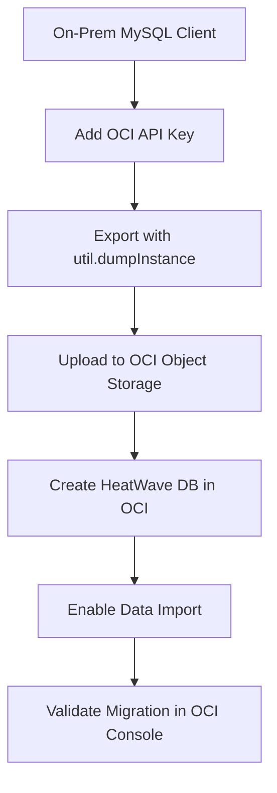

## 🚀 Operating and Migrating to MySQL HeatWave on OCI

In this module, you'll learn how to **operate your MySQL HeatWave system** using the **Oracle Cloud Infrastructure (OCI) Console**, and how to **migrate data** from an **on-premise MySQL database** to the MySQL HeatWave Database Service.

---

### 🔄 From On-Premises to Cloud: Why Migrate?

#### 🖥️ On-Premises MySQL Challenges
- Requires data center space, power, cooling, and disaster recovery
- Manual server, storage, OS, and DB management
- High costs, time, and continuous maintenance efforts

#### ☁️ MySQL HeatWave Advantages
- Fully managed MySQL service on **OCI**, **AWS**, or **Azure**
- Auto-patching and backups with **MySQL Enterprise Edition**
- High availability (99.99% uptime) and **zero data loss**
- Built-in **analytics** and **machine learning**
- Advanced security: encryption, masking, and de-identification

---

### 🧭 Migration Workflow Overview

1. **Plan**
2. **Export**
3. **Import**
4. **Validate**

---

### 🧰 Pre-Migration Checklist

- ✅ Access to OCI Console and tenancy
- ✅ Compartment and **Virtual Cloud Network (VCN)** setup
- ✅ Permissions and policies for MySQL HeatWave
- ✅ Compute instance and Object Storage Bucket
- ✅ MySQL Shell installed

---

### 🧪 Tools for Migration

- **MySQL Shell:** Advanced CLI for SQL, JS, and Python scripting
- **MySQL Shell Upgrade Checker:** Verifies upgrade compatibility
- **MySQL Shell `util.dumpInstance`:** Exports DB to local files or OCI Object Storage

📝 *Note:* This tool only checks compatibility; **fixes must be handled manually**.

---

### 🧠 Assessment Phase

Use tools like **MySQL Workbench** or **Oracle SQL Developer** to:

- Compare schemas, tables, columns, indexes, and triggers
- Identify:
  - Incompatible data types or formats
  - Charset differences
  - Date/time and null value handling
- Estimate:
  - Data size
  - Migration time
  - Required compute/storage for migration

---

### 📤 Export Phase

Steps to export on-premise MySQL:

1. Create an **OCI Object Storage bucket**
2. Add an **OCI API key** on the MySQL client machine
3. Run:

```bash
util.dumpInstance("user@localhost", {
  ocimds: true,
  threads: 4,
  osBucketName: "your-bucket",
  osNamespace: "your-namespace"
})
```
4. Exports **all schemas**, **users**, **routines**, and **triggers**
5. Performs **compatibility checks**
6. ⚠️ **No pause/resume** — export must be restarted if interrupted

---

### 📥 Import Phase

To import into **MySQL HeatWave**:

1. Go to **OCI Console** → `Databases > MySQL HeatWave`
2. Click **Create DB System**
3. In **Advanced Options**, open the **Data Import** tab
4. Provide the following:
   - **Object Storage Bucket** or **Pre-Authenticated Request (PAR) URL**
5. Click **Create**  
   The system will:
   - ✅ Provision the database system
   - ✅ Automatically **load data** from Object Storage

---

### ✅ Post-Migration Validation

- 🧾 **Check logs** and DB system status
- 🔍 **Verify** the following:
  - Tables
  - Users
  - Views
  - Stored procedures
- 🧪 **Run test queries** to confirm performance and data integrity

---

### 🗂️ Migration Process Summary


### 🧘 What You Learned

✅ How to **operate** a MySQL HeatWave system on **Oracle Cloud Infrastructure (OCI)**  
✅ How to **export and import data** using **MySQL Shell**  
✅ How to use the **OCI Console** for full **migration and validation**  
✅ How to perform **compatibility checks** prior to migration  
✅ How to **automate** and **simplify operations** with HeatWave's built-in tools

---

### 🎯 You're Now Ready!

You're now equipped to **migrate**, **manage**, and **optimize** MySQL workloads on **Oracle Cloud** with confidence. 🚀  
Leverage the power of **HeatWave** to unlock real-time analytics, machine learning, and high availability — all in a single, unified MySQL platform.

